<div align="center">

<!-- Banner -->


<!-- Typing animation -->
<a href="https://git.io/typing-svg">
  
</a>

<br/><br/>

<!-- Social badges -->
[](https://www.linkedin.com/in/buiducquang/)
[](https://github.com/duckyquang)

<br/><br/>


</div>

---

## About Me

```text
16 (not an unc sadly)
AI/ML Researcher & Builder
Executive Director @  Synthica · SAID Lab
```

I'm **Quang Bui** — most people call me **Buno**. I work at the intersection of **research and production**: designing AI systems that are rigorous enough for the lab and robust enough for the real world.

I care about **clarity in complex systems** — whether that's a model architecture, a research pipeline, or an organization building with AI. I lead, I build, and I stay close to the code.

<br/>

<table>
  <tr>
    <td valign="top" width="50%">

### Focus Areas

- **Machine Learning & Deep Learning** — model design, training, evaluation
- **AI Systems** — pipelines, deployment, and integration at scale
- **Research Leadership** — bridging academia and applied AI
- **Product & Strategy** — turning research into durable impact

    </td>
    <td valign="top" width="50%">

### Currently

- Collaborating with peers at **top institutes** to advance AI research
- Leading **Synthica** — Making research approachable for everyone
- Building **SAID Lab** — applied AI research and experimentation
- Open to meaningful collaborations in AI, research, and product

    </td>
  </tr>
</table>

---

## Tech Stack

### Languages

<div align="center">


</div>

### Tools & Frameworks

<div align="center">


<br/><br/>


</div>

---

## GitHub Analytics

<div align="center">




<br/>



</div>

<br/>

<div align="center">


</div>

---

## Let's Connect

<div align="center">

I'm always open to conversations around **AI research**, **technical leadership**, and **building things that matter**.

<br/>

[](https://www.linkedin.com/in/buiducquang/)
[](https://github.com/duckyquang)

<br/><br/>

*"The best way to predict the future is to build it."*

</div>

<br/>

<div align="center">
  
</div>
